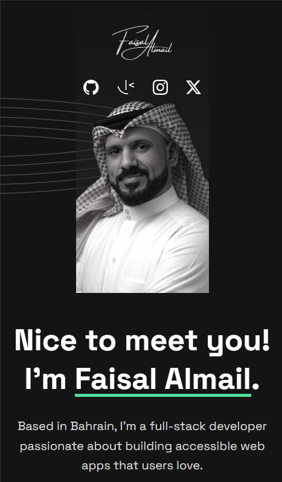
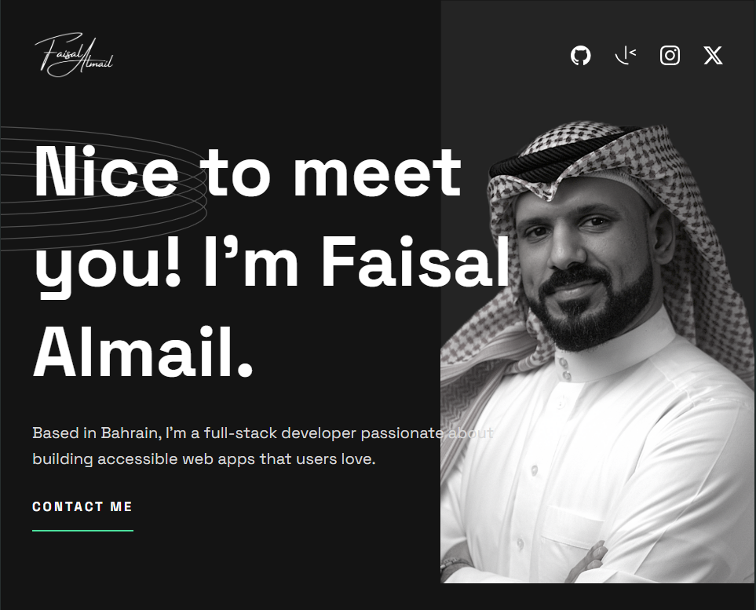
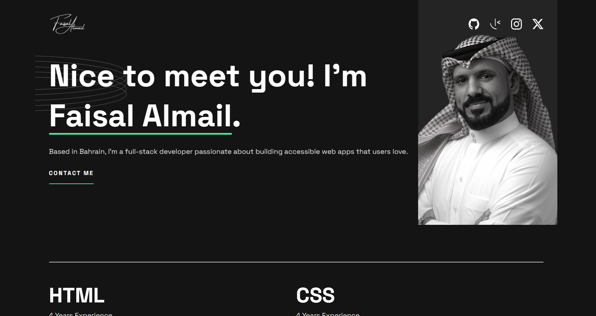

# Frontend Mentor - Single-page developer portfolio solution

This is a solution to the [Single-page developer portfolio challenge on Frontend Mentor](https://www.frontendmentor.io/challenges/singlepage-developer-portfolio-bBVj2ZPi-x). Frontend Mentor challenges help you improve your coding skills by building realistic projects. 

## Table of contents

- [Overview](#overview)
  - [The challenge](#the-challenge)
  - [Screenshot](#screenshot)
  - [Links](#links)
- [My process](#my-process)
  - [Built with](#built-with)
  - [What I learned](#what-i-learned)
  - [Continued development](#continued-development)
  - [Useful resources](#useful-resources)
- [Author](#author)
- [Acknowledgments](#acknowledgments)

## Overview

### The challenge

Users should be able to:

- Receive an error message when the `form` is submitted if:
  - Any field is empty
  - The email address is not formatted correctly
- View the optimal layout for the interface depending on their device's screen size
- See hover and focus states for all interactive elements on the page
- **Bonus**: Hook the form up so it sends and stores the user's enquiry (you can use a spreadsheet or Airtable to save the enquiries)
- **Bonus**: Add your own details (image, skills, projects) to replace the ones in the design

### Screenshot

**Screenshots to be added**

### Links

- Solution URL: [https://github.com/faisalalmail/Single-page-developer-portfolio](https://github.com/faisalalmail/Single-page-developer-portfolio)
- Live Site URL: [https://serene-tiramisu-c891db.netlify.app/](https://serene-tiramisu-c891db.netlify.app/)

## My process

### Built with

- Semantic HTML5 markup
- CSS custom properties
- Flexbox
- CSS Grid
- Mobile-first workflow
- Javascript

### What I learned

**So...** This is the first project which I am customizing to my own use. I spent some time getting it responsive as per the design. Everytime I learn that I should spend more time planning, because many things appear lately during development that causes things to be re-done.

I guess the main points here are:

- I used CSS filter for the first time.
- I wired the form to a node api which in turn sends the entries to a database and also by email.

### Continued development

**Features to add:**
- Replace the dummy projects to my actual projects.
- Load the projects from a JSON file instead of hardcoding them.
- ~~work on data validation in the form with error handling~~ and probably adding a capcha.

**Maybe**
- Add a blog section
- Add testimonials section

### Useful resources

- [CSS grid generator](https://cssgrid-generator.netlify.app/) - CSS grid generator is always the go to tool when it comes to making a grid.
- [CSS filter generator](https://angel-rs.github.io/css-color-filter-generator/) - This tool was helpful to generator the filter that color's the white icons on hover.

## Author

- Website - [Add your name here](https://www.your-site.com)
- Frontend Mentor - [@FaisalAlmail](https://www.frontendmentor.io/profile/faisalalmail)
- Github - [@FaisalAlmail](https://github.com/faisalalmail)

## Acknowledgments

After God, I thank me for sticking with me and supporting me through the course of this project.

